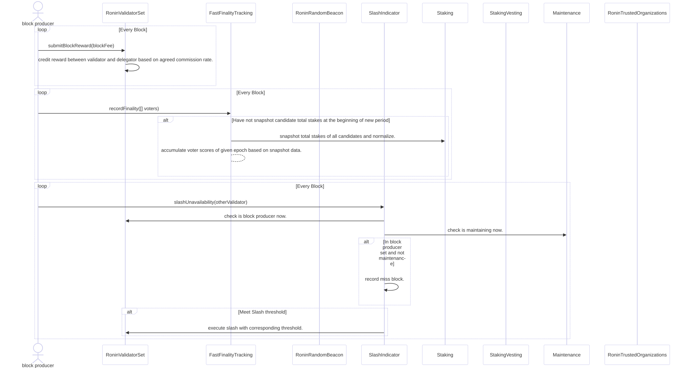

# Block Based Operations

---

## 1. Finality Tracking

- **Block Producer** records voter data in `FastFinalityTracking`.
- If no snapshot exists for the period:
  - `FastFinalityTracking` takes a **staking snapshot** via `Staking` and normalizes data.
  - Voter scores are accumulated for the epoch based on snapshot data.

---

## 2. Slashing Mechanism

- **Block Producer** reports unavailable validators to `SlashIndicator`.
- **Verification**:
  - Validator’s block producer status (`RoninValidatorSet`).
  - Validator’s maintenance status (`Maintenance`).
- **Actions**:
  - Record missed blocks for eligible validators.
  - Executes slashing when thresholds are met via `RoninValidatorSet`.

---

## 3. Reward Distribution

- **Block Producer** submits block fees to `RoninValidatorSet`.
- **Reward Flow**:
  - Bonus rewards for block production are requested via `StakingVesting`.
  - Rewards are distributed between validators and delegators based on the commission rate.

---

### Key Insights

- **Efficiency**: Tracks finality, distributes rewards, and enforces penalties consistently.
- **Accountability**: Maintains validator performance through slashing.
- **Incentives**: Encourages participation with bonus and commission-based rewards.

---
