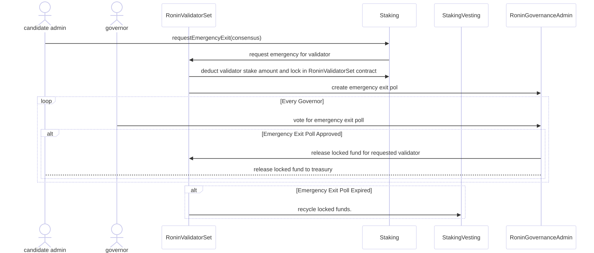

# Emergency Exit

## Overview

The emergency exit process allows all candidates to withdraw their stake under exceptional circumstances. It involves governance approval and ensures the integrity of the network through a structured workflow.

---

## 1. Emergency Exit Request

- **Actor**: Candidate Admin
- **Process**:
  1. **Request Initiation**:
     - The candidate admin submits a `requestEmergencyExit(consensus)` call to the `Staking` contract.
  2. **Stake Locking**:
     - `Staking` forwards the emergency request to `RoninValidatorSet`.
     - `RoninValidatorSet` deducts the validator’s stake and locks it in its contract.
  3. **Poll Creation**:
     - `RoninValidatorSet` submits a request to `RoninGovernanceAdmin` to create an emergency exit poll.

---

## 2. Governance Voting

- **Actor**: Governors
- **Process**:
  - Governors vote on the emergency exit poll created by `RoninGovernanceAdmin`.

### Outcomes

1. **Poll Approved**:
   - **Actions**:
     - `RoninGovernanceAdmin` instructs `RoninValidatorSet` to release the locked funds for the validator.
     - Locked funds are returned to the candidate admin’s treasury.
2. **Poll Expired**:
   - **Actions**:
     - Expired polls result in the locked funds being recycled into the `StakingVesting` contract.

---

## Notice

- Validators who initiate an emergency exit are no longer eligible for block production.  
- However, they remain on the candidate list until the epoch ending of the revoking timestamp.  
