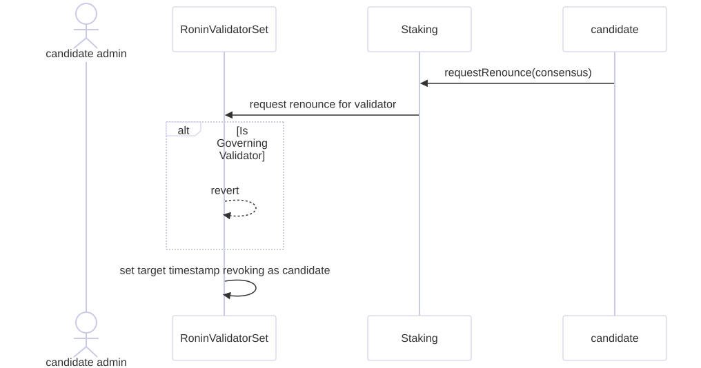

# Renouncing as a Validator

---

## Overview

The renounce process allows non governing validators to voluntarily step down from their role. This action is initiated by the candidate admin and processed through the `Staking` and `RoninValidatorSet` contracts. Governing validators are restricted from renouncing their role.

---

## 1. Renounce Request

- **Actor**: Candidate Admin
- **Process**:
  1. The candidate admin submits a `requestRenounce(consensus)` call to the `Staking` contract.
  2. `Staking` forwards the renounce request to the `RoninValidatorSet`.

---

## 2. Governance Restriction

- **Condition**: If the validator is a **Governing Validator**, the `RoninValidatorSet` will reject the renounce request and revert the transaction.

---

## 3. Renunciation Process

- **Condition**: For non-governing validators, the renounce request proceeds.
- **Actions**:
  1. `RoninValidatorSet` schedules a **revoking timestamp**.
  2. The validator remains in their role until the target timestamp is reached.

---

---

## Notice

- Validators in the renounce process are still eligible for block production and rewards until their role is officially revoked at the target timestamp.
- Once revoked, they are removed from the candidate list and can no longer participate in block production.
- On renunciation, the validator's can still be slashed for any missed blocks or malicious behavior.

---
